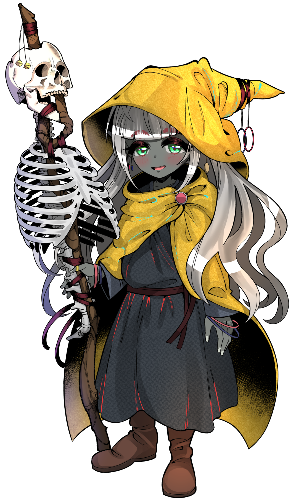

# シマ キャラクター評

**Ver.1.1（第12回セッション終了時点）**

---

## 基本情報

- **種族**：不明（推測：ヒューマン）
- **職業**：不明
- **外見的特徴**：「髑髏を掲げし少女」として描写される。休憩所から一人後を付けていた。

## 身体的特徴

{ width="400" }

- **外見**：「髑髏を掲げし少女」として描写される
- **全体的な印象**：確かな覚悟が宿った瞳を持つ。ノクシルに気付かれずに後を付けていた。

## 性格・特徴

### 核心的性格

シマは、「髑髏を掲げし少女」として描写される。彼女の瞳には確かな覚悟が宿っていた。シャルルは「人が試練に立ち向かうのを止める立場にはない。共に進むだけだ」と感じている。

### 行動パターン

1. **後を付ける** - 休憩所から一人後を付けていた。ノクシルに気付かれずに近付き、話しかけると随分と驚かせてしまった。

2. **巡礼者の客人** - 巡礼者の客人のようだ。休憩所に宿をとるようなので、明朝ともに拘置所へと行くこととした。

3. **戦闘への参加** - ノクシルと共に「髑髏を掲げし少女」シマも加わっていた。グールどもの巣を追う冒険に参加する。

4. **治療能力** - シマの《キュア・ウーンズ》の光がシャルルの身体を包む。治療能力を持つ。

### 冒険者との関係

- **ノクシル**：休憩所から一人後を付けていた。ノクシルに気付かれずに近付き、話しかけると随分と驚かせてしまった。どうやら敵意はないらしい。

- **シャルル**：シャルルは「人が試練に立ち向かうのを止める立場にはない。共に進むだけだ」と感じている。シマの《キュア・ウーンズ》で救われた。

- **巡礼者**：巡礼者の客人のようだ。

### 背景・設定

- **「髑髏を掲げし少女」**：この異名で呼ばれる
- **覚悟**：彼女の瞳には確かな覚悟が宿っていた
- **治療能力**：《キュア・ウーンズ》を使用できる
- **クラス**：バード（推測）- バードインスピレーションや幽霊の援護などの能力を持つ

### 戦闘能力

- **バードインスピレーション** - 仲間に声援ダイス（インスピレーションダイス）を付与し、判定を支援する
- **幽霊の援護** - リアクションで味方の攻撃にダメージを加算する（3＋魅力修正値）
- **クロスボウ** - 遠距離攻撃手段を持つ
- **《キュア・ウーンズ》** - 治療呪文

### リプレイでの描写のポイント

1. **覚悟** - 確かな覚悟が宿った瞳
2. **治療とサポート** - 《キュア・ウーンズ》やバードインスピレーションで仲間を支援
3. **冒険への参加** - グールどもの巣を追う冒険に参加する
4. **巡礼者との関係** - 巡礼者の客人のようだ
5. **幽霊との繋がり** - 幽霊の援護能力を持ち、霊的な存在と繋がりがある

