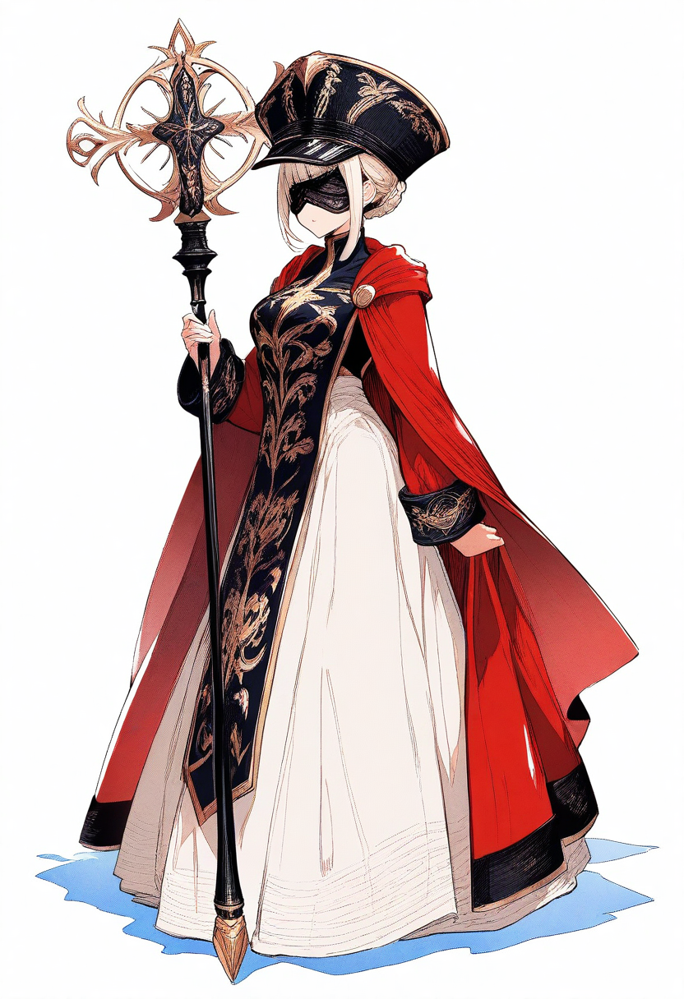

# セラフィナ キャラクター評

**Ver.1.0（第11回セッション終了時点）**

---

## 基本情報

- **種族**：ヒューマン（推測）
- **職業**：不明
- **関係**：シャルル・ビアトリスの妹
- **外見的特徴**：シャルルの妹として、楽しそうな顔を見せる。

## 身体的特徴

{ width="400" }

- **外見**：シャルルの妹として描写される
- **全体的な印象**：楽しそうな顔を見せる。シャルルは「妹の楽しそうな顔をみるのはいつだっていいものだ」と感じている。

## 性格・特徴

### 核心的性格

セラフィナは、シャルル・ビアトリスの妹。シャルルにとって大切な存在で、妹の楽しそうな顔を見るのはいつだっていいものだ。

### 行動パターン

1. **楽しそうな顔** - つまらなそうに最前列に並んでいたセラフィナが、これから始まる大捕り物を予見したのか、楽しそうな顔になったのをシャルルは視線の隅で捉えた。

2. **失踪** - ファルジーン島で姿を消した。シャルルがファルジーン島へ向かう動機となっている。

### シャルルとの関係

- **姉妹関係**：シャルルにとって大切な妹。妹の楽しそうな顔を見るのはいつだっていいものだ。

- **失踪**：ファルジーン島で姿を消した。シャルルは妹を探すことが、ファルジーン島へ向かう動機となっている。

- **過去の出来事**：ディクスター司祭の不正を暴く場面で、セラフィナはつまらなそうに最前列に並んでいたが、これから始まる大捕り物を予見したのか、楽しそうな顔になった。

### 背景・設定

- **シャルルの妹**：シャルル・ビアトリスの妹として、重要な存在。

- **失踪**：ファルジーン島で姿を消した。現在の状況は不明。

### リプレイでの描写のポイント

1. **楽しそうな性格** - 楽しそうな顔を見せる
2. **シャルルとの関係** - 姉妹として深い絆
3. **失踪** - ファルジーン島で姿を消した
4. **動機** - シャルルがファルジーン島へ向かう動機

