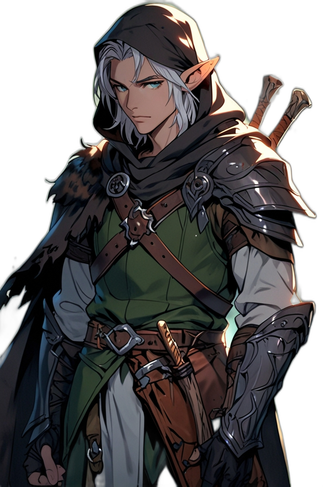

# ノクシル・グリムホルト キャラクター評

**Ver.1.1（第12回セッション終了時点）**

---

## 基本情報

- **プレイヤー**：タツヤ
- **種族**：エルフ
- **クラス**：レンジャー
- **外見的特徴**：エルフらしく若い見た目だが、定命のものとは違い、一体いつから生きているのか知るものは少ない。見た目が変わらないが、周囲の人間は成長していく。

## 身体的特徴

{ width="400" }

- **外見**：エルフらしく若い見た目。エルフ特有の優雅さと鋭さを兼ね備えた外見
- **年齢感**：見た目は若いが、実際の年齢は不明。定命のものとは違い、一体いつから生きているのか知るものは少ない
- **時間の経過**：見た目が変わらないが、周囲の人間（特にセンサ船長）は成長していく。種族の違いによる時間感覚の差を実感している
- **戦闘スタイル**：二刀使いの戦闘スタイルに適した身体能力を持つ。レンジャーとしての高い身体能力と、エルフとしての優雅さを併せ持つ

## 性格・特徴

### 核心的性格

ノクシルは、流浪のレンジャーとして各地を放浪し、人知れず善行を行っている。エルフとしての長い寿命と、人間との時間感覚の違いを実感しながらも、人間との絆を大切にする。センサ船長との関係は特に深く、種族の違いによる時間感覚の差を感じながらも、変わらぬ友情を保っている。

### 行動パターン

1. **人知れず善行を行う** - 酒場から消え、また暦が巡ると時たまふらりとその場所に帰ってくる。その度に、酒場の住人が増え、街が良くなってゆく。表立って語らないが、確かな行動力を持つ。

2. **センサ船長との絆** - 半年ごとにあるアイテム（トーテム）を通して連絡を取り合う。2年ぶりの再会でも、変わらぬ友情を感じさせる。船長がついに船長になったことを心から喜び、船の運行を手伝うことを快く引き受ける。

3. **観察力と洞察力** - センサ船長の内心の不安（漂流状態への危惧）に気づく。巡礼者が邪悪なものかと気にしたが、そうではなさそうだと判断し、見守る姿勢を取る。地下で発見したマークから「ノクシル」という邪教集団の存在を察知し、グールとの盟約が破られていることを理解する。

4. **責任感と配慮** - 決闘騒ぎで船長とシャルルのプライドを傷つけたお詫びに、釣りと調理で2人分働くことを決める。船員たちを気遣い、料理人夫婦とも親しくなる。

5. **戦闘における実力** - 二刀使いの戦闘スタイルで、圧倒的な火力を発揮する。オクトパスにクリティカルを決め、深きものとの戦いでも中心的な役割を果たす。エルフらしく魔法の矢も使う。第12回ではメイジ・アンデッドに対して不意打ちクリティカルを決め、一撃で瞬殺した。

6. **前向きな姿勢** - 嵐の後、船長が不安を抱えているのを見て「無事に乗り切れば良い冒険譚になるだろうさ」と前向きな言葉をかける。

7. **正義感と道徳観** - 奴隷売買の帳簿を発見した際、「命を金でやり取りするのだ。あってはならない」と強い怒りを示す。不正や人道に反する行為に対して毅然とした態度を取る。

8. **戦術的判断** - 戦闘中、敵が自爆する可能性を察知して離脱する判断力を持つ。レンジャーとしての戦い方を誇りに思い、不意打ちや戦術的撤退を恥としない。

### 特徴的な言動

- 「船長がついに船長になったのか」- センサ船長の成長を喜ぶ
- 「楽しみにしてるよ。船長」- 変わらぬ友情を示す
- 「無事に乗り切れば良い冒険譚になるだろうさ」- 前向きで楽観的な姿勢
- 「問題ない、ありがとう」- 仲間に助けられた際の感謝
- 「エルフは寝る必要がないんだよ」- エルフとしての特性を説明
- 「命を金でやり取りするのだ。あってはならない」- 奴隷売買への強い怒り
- 「待て。この先はグールに敵対する何かがいるかもしれない」- グールとの盟約についての知識と洞察
- 「いいか。俺の声であいつを落とす」「俺に続け巡礼者」- 戦闘における統率力
- 「これはレンジャーの戦い方だから」「レンジャーの戦い方が役に立つ時だってある」- レンジャーとしての誇り

### 戦闘スタイル

- **二刀使い** - 圧倒的な火力を発揮する戦闘スタイル
- **弓術** - オクトパスにクリティカルを決めるなど、弓の技術も高い
- **魔法の矢** - エルフらしく魔法の矢も使用する
- **レンジャーのスキル** - ジャイアントボアをあっという間に発見するなど、追跡や探索の能力が高い

### 人間との関係

- **センサ船長**：最も深い絆を持つ。昔、アル人と訪れていた時に出会ったやんちゃな少女だったセンサを、溺れそうになったところを助け、一緒に遭難した先で隠した。以来、彼女のことを「船長」と呼ぶようになった。種族の違いによる時間感覚の差を感じながらも、変わらぬ友情を保つ。

- **シャルル**：船上でのわだかまりはとっくに溶けていた。肩を並べて戦闘を繰り返すうちに、自然にモヤモヤした黒い思いは消えてなくなった。寝具を貸すなど、気遣いを見せる。

- **巡礼者**：最初は邪悪なものかと気にしたが、そうではなさそうだと判断。軽口の応酬やじゃれ合いをする関係。手合わせを申し出られたが、本気で戦っていないと見るや興が覚められた。

### 背景・設定

- エルフとして長い寿命を持つが、見た目は変わらない
- 父さんと母さん、ザイドとザンドールという名を聞いた過去がある
- **ドリッズド**：かつて旅を共にした人物で、ノクシルの憧れの対象。D&Dの著名なキャラクター「リッズト・ドゥアーデン」であることがプレイヤーから匂わせられている。ノクシルは「まだまだドリッズドには及ばない。今の俺にはちょうど良いのかもしれないな」と感じている。グウェンやウルフガーも同じ旅の仲間だった。
- 現在の仲間たち（シャルル、巡礼者）は「まだまだドリッズドには及ばない。今の俺にはちょうど良いのかもしれないな」と感じている

### リプレイでの描写のポイント

1. **エルフとしての時間感覚** - 見た目が変わらないが、周囲の人間は成長していく。センサ船長との関係で特にこの違いを感じる。

2. **人知れず善行を行う姿勢** - 表立って語らないが、確かな行動力と責任感を持つ。

3. **観察力と洞察力** - センサ船長の内心の不安に気づくなど、細やかな気配りができる。

4. **戦闘における実力** - 二刀使いの圧倒的な火力と、レンジャーとしての高いスキル。

5. **前向きで楽観的な姿勢** - 困難な状況でも前向きな言葉をかける。

6. **仲間への気遣い** - 船員たちや仲間を気遣い、責任感を持って行動する。

