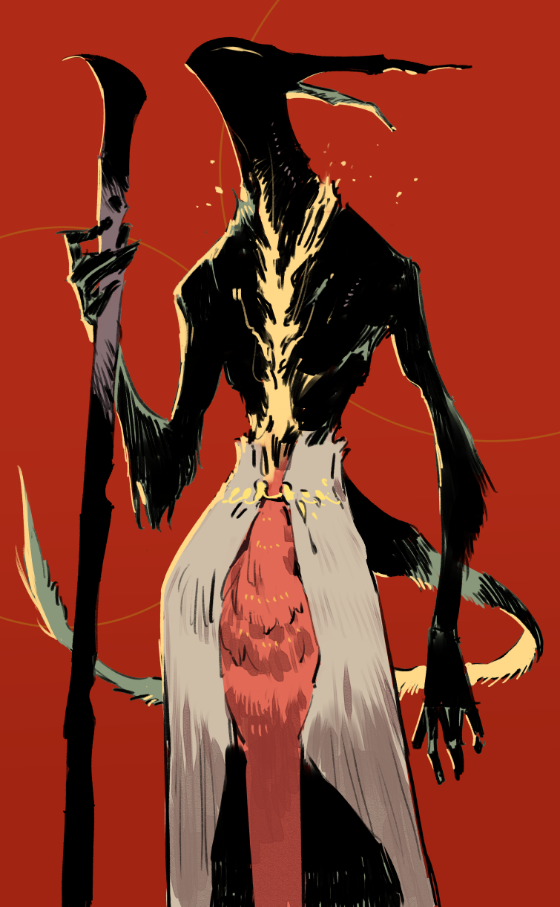

# 巡礼者 キャラクター評

**Ver.1.0（第11回セッション終了時点）**

---

## 基本情報

- **プレイヤー**：チョモラン
- **種族・種別**：シュブ＝ニグラスの信者、次元界を漂う存在
- **外見的特徴**：黒くて不気味な姿、しかし邪気はない。巨大な蹄の足跡を残すほどの体躯を持つ可能性がある

## 身体的特徴

{ width="400" }

- **外見**：黒くて不気味な姿。異形の存在として、人間とは明らかに異なる外見を持つ
- **体躯**：巨大な蹄の足跡を残すほどの体躯を持つ可能性がある。同胞である黒き子山羊と同様の足型をしている
- **目**：光る瞳を持つ。その瞳には純粋な光が隠れている
- **声**：目や声にはまったく邪気がないとシャルルは感じている
- **全体的な印象**：驚くほど不気味で不浄な姿とは裏腹に、邪気のない純粋な存在

## 性格・特徴

### 核心的性格

巡礼者は、シュブ＝ニグラス（黒き子山羊の母）に仕える存在として、人間とは異なる価値観と世界観を持つ。しかし、その異形の姿とは裏腹に、純粋で邪気のない心を持っている。

### 行動パターン

1. **主の命に従う** - シュブ＝ニグラスの命を受け、ファルジーン島の異変を調査するために旅立つ。信者の声が聞こえなくなったことを主から聞き、使命を帯びて島へ向かう。

2. **戦士を求める** - 目的を遂行するために、実力のある戦士を探している。シャルルとノクシルを「実力のある戦士」として認め、協力を求める。

3. **興味の対象** - 戦闘や強さに興味を示す。ノクシルと手合わせを申し出るが、相手が本気で戦っていないと見るや興が覚め、試合をやめる。ノクシルの活躍を見逃したことを残念がる。

4. **異形への理解** - 自身も異形であるため、他の異形（深きもの、グールなど）に対して、人間とは異なる視点を持つ。しかし、邪悪な存在に対しては戦う。

5. **純粋な好奇心** - 人間の行動や価値観について、純粋な好奇心を持って問いかける。シャルルとの会話で「なぜ蛇人間を食べないのか」「なぜ同族を食べないのか」と問い、人間の「矜持」について理解を深めようとする。

### 特徴的な言動

- 「お前たちの造形がまた一つ深まった。ますます、お前たちとの旅が楽しくなってきたよ」- 人間の価値観を学ぶことを楽しんでいる
- 「それは汚れているのではない、ただ自分にとって不都合だから敵と見做しているだけだ。だが不都合であるのなら、殺すしかない。私はそう思っているぞ」- 実用的で、しかし無慈悲ではない判断力
- 「もう眠い。お前もノクシルももう寝ろ」- 仲間を気遣うが、人間とは異なる時間感覚を持つ

### 戦闘スタイル

- クラブやオクトパスなどの異形を切り伏せる戦闘能力を持つ
- 同胞である黒き子山羊の存在を感じ取る
- 戦闘においては仲間と協力し、力を発揮する

### 人間との関係

- **シャルル**：人間の価値観を学ぶ対象として興味を持つ。宗教問答を通じて、自分自身と対話しているような錯覚を与える。
- **ノクシル**：実力のある戦士として認め、軽口の応酬やじゃれ合いをする関係。手合わせを申し出るが、本気で戦っていないと見るや興が覚める。
- **ネギ**：案内役として必要とし、信頼している。

### 背景・設定

- シュブ＝ニグラスの信者として、次元界を漂う存在
- ファルジーン島には昔から同胞（黒き子山羊）がいる
- ザントゥーの石板を発見し、難解な内容を少しずつ読み進めている
- 人間とは異なる時間感覚と価値観を持つが、邪気はない

### リプレイでの描写のポイント

1. **異形性と純粋さの対比** - 不気味で不浄な姿だが、目や声には邪気がない
2. **人間への好奇心** - 人間の行動や価値観を学ぼうとする姿勢
3. **戦士としての実力** - 戦闘においては確かな実力を持つ
4. **主への忠誠** - シュブ＝ニグラスの命に従う姿勢
5. **仲間への気遣い** - 人間とは異なる時間感覚だが、仲間を気遣う

